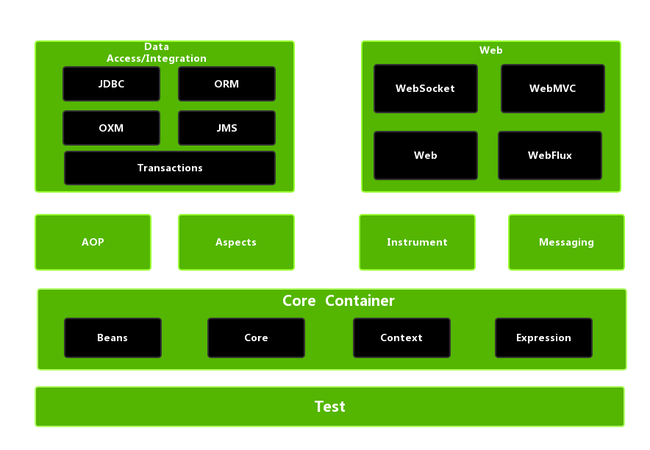

## Spring

Spring is a open source light weight java development framework

Spring core feature: IOC and AOP




### Spring IOC

IoC Inverse of Control is a thought of design, not a specific implementation. In java spring, ioc is letting spring container to create object instead of doing so in class.


* Inverse: give the control to external class (spring framework, IoC container)
* Control: new object instance


#### IoC benefit

1. Decouple class objects
2. Easy to control resource

Example: User classm has Service and Dao layer

Without IoC

```java
public class UserDaoImpl implement IUserDao{
  
}
```

```java
Public class UserServiceImpl implement IUserSercvice {
  private IUserDao userDao = new UserDaoImpl();
}
```

If later there is another implementation class of `IUserDao`, and we need to change it in `UserServiceImpl` class. Which is bad, it there are a lot of classes depend on `IUserDao`


With IoC:

```java
public class UserDaoImpl implement IUserDao{
  
}
```

```java
public class NewUserDaoImpl implement IUserDao{
  
}
```

```java
Public class UserServiceImpl implement IUserSercvice {
  @Autowired
  private IUserDao userDao;
}
```


In spring, IoC container is the container to implement IoC convention. Itself is a key-value map


**IoC and DI**

DI is the most common way to implement IoC.


### Spring Bean

What is spring bean?

A spring bean is an object managed by the spring IoC container along with some metadata

In Spring, we can use XML file to config bean.


#### Annotation to declare class as Bean

* `@Component` general annotation
* `@Repository`: Dao layer, used for JDBC operation
* `@Service`: Service layer, usually need Dao layer
* `@Controller` Spring MVC controller layer, used to receive client request and send responce.


#### @Component and @Bean

* `@Component` annotation upon class, `@Bean` annotation upon on method
* 


### @Autowired

In Spring framework, `@Autowired` is a popular annotation used for automatic dependency injection.

When the Spring sees `@Autowired` on fields, constructors, setter methods, or config methods, it attempts to fulfill the dependency by searching the application context for matching beans.


####  The basics of `@Autowired`

In spring, `@Autowired` annotation is used to auto-wired Spring beans into other beans, let Spring automatically satisfy bean dependencies. 


##### how Spring resolves dependencies

When place `@Autowired` annotation on a field, constructor or method,


