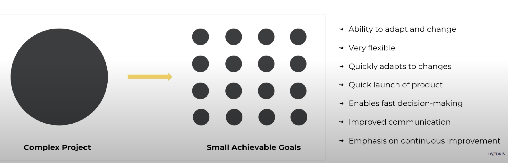
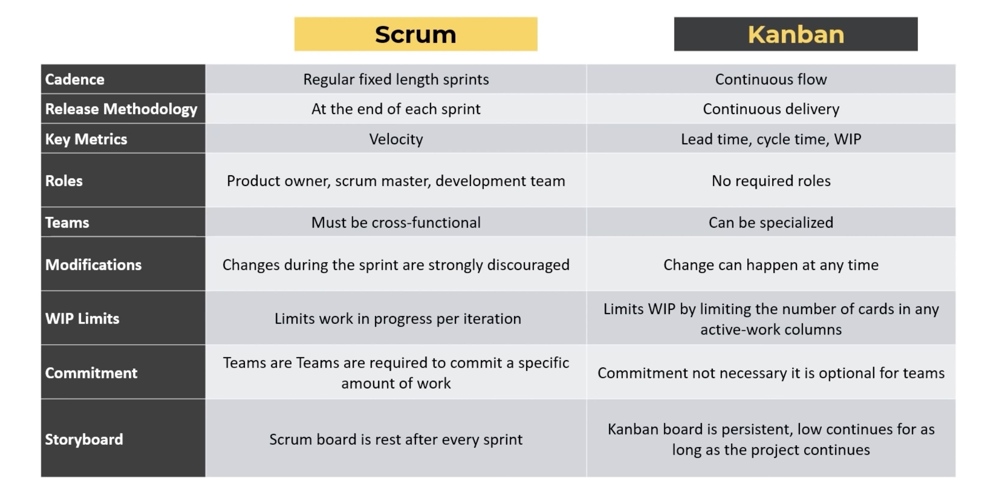

## Agile SDE

### What is Agile SDE

A set of frameworks and practices that break down complex projects into small manageable goals.

### Similarites between scrum and kanban

* Pull system: where work is pulled only if there is a demand for it.
* Limit work-in-progress: Limit WIP will allow teams to identify bottlenecks and improves throughput
* Break down complex tasks
* High value on continual improvement

### Scrum

#### 

### Kanban

### Scrum vs Kanban

